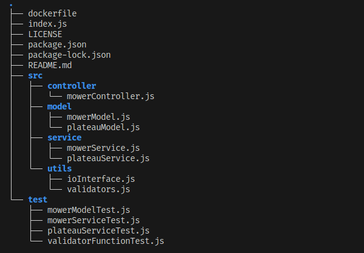
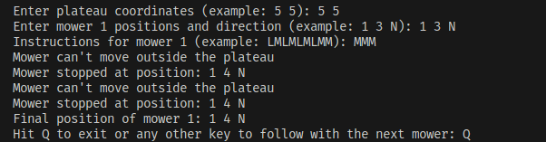

<a name="readme-top"></a>

# Seat-Code-Kata

## Instructions

<details>
<summary>Instructions for the challenge</summary>
<br>
SEAT:CODE has been asked for a really important project. We need to develop an application that helps in controlling brand new mowers
from the SEAT Martorell Factory.

SEAT Martorell factory has a lot of green spaces but for the MVP, we will consider only one single green grass plateau to simply the problem.

A green grass plateau, which is curiously rectangular, must be navigated by the mowers.

A mower’s position and location are represented by a combination of X and Y coordinates and a letter representing one of the four cardinal compass
points (N, E, S, W). The plateau is divided up into a grid to simplify navigation. An example position might be 0, 0, N, which means the mower is in
the bottom left corner and facing North.

In order to control a mower, SEAT Maintenance Office sends a simple string of letters. The possible letters are “L”, “R” and ”M”. “L” and “R” make the
mower spin 90 degrees left or right respectively, without moving from its current spot. “M” means to move forward one grid point and maintain the same Heading.
Assume that the square directly North from (X, Y) is (X, Y + 1).

### Input

The first line of input is the upper-right coordinates of the plateau,
the bottom-left coordinates are assumed to be 0, 0.
The rest of the input is information pertaining to the mowers that have been deployed.

Each mower has two lines of input.
The first line gives the mower’s position, and the second line is a series of instructions telling the mower how to explore the plateau.

The position is made up of two integers and a letter separated by spaces, corresponding to the X and Y coordinates and the mower’s orientation.
Each mower will be finished sequentially, which means that the second mower won’t start
to move until the first one has finished moving.

### Output

The output for each mower should be its final coordinates and heading.

Input Test Case #1:

```
5 5
1 2 N
LMLMLMLMM
3 3 E
MMRMMRMRRM
```

Output Test Case #2:

```
1 3 N
5 1 E
```

</details>

## Project architecture



## Installation

<!-- Try it -->

- Clone this repository:

        git@github.com:AdrianaP00/Seat-Code-Kata.git

- Inizialize the project:

        npm install --save
        npm run start

- Test command:

        npm run test


- Docker command:

         npm run docker


---

<!-- Tested on -->

### Tested on:

- Ubuntu 22.04
- Node 20.0.0
- Docker version 20.10.12

### Built With

- [![Node][Node]][Node-url]
- [![Docker][Docker]][Docker-url]

### Shell output



## Discover more about this project in my SOLUTION.md :boom:

[CLICK ME!](https://github.com/AdrianaP00/Seat-Code-Kata/blob/main/SOLUTION.md)

[MIT](https://choosealicense.com/licenses/mit/)

<p align="right">(<a href="#readme-top">back to top</a>)</p>

[Node]: https://img.shields.io/badge/Node-v.20-green
[Node-url]: https://nodejs.org
[Docker]: https://img.shields.io/badge/Docker-v.20.10.12-blue
[Docker-url]: https://docker.com
